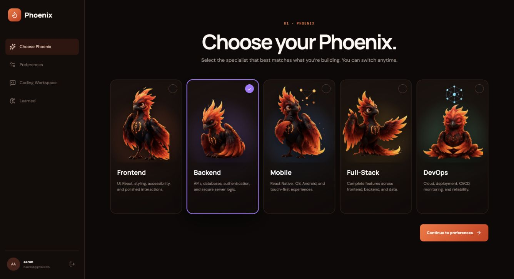
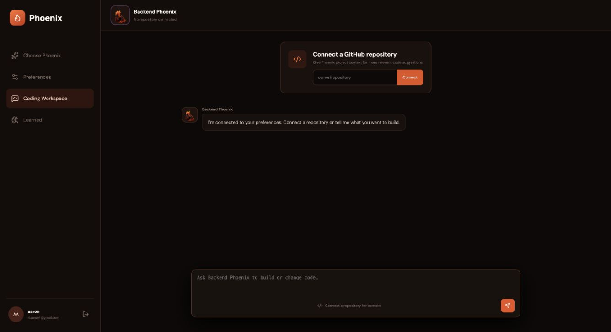

# Temper

> Stop teaching your AI the same things twice.

Temper is a memory layer for AI coding tools. It learns the stack, architecture, naming conventions, testing habits, and communication style a developer approves, then applies that context in future sessions.

**Live demo:** [ychackathon.vercel.app](https://ychackathon.vercel.app)

<p align="center">
  
</p>



## The problem

Every new AI conversation starts from zero. Developers repeatedly explain the same project context and preferences, yesterday's decisions disappear, and generic output creates more correction and rework.

Temper turns those corrections into a portable developer profile. Correct the AI once, approve what it should remember, and the preference is available the next time you build.

## How it works

1. **Pick your Phoenix** — choose a Frontend, Backend, Mobile, Full-Stack, or DevOps specialist.
2. **Set your preferences** — seed your stack, style, and engineering standards.
3. **Connect a repository** — give Phoenix project context for more relevant suggestions.
4. **Build with Phoenix** — work inside the AI coding workspace.
5. **Approve useful corrections** — Temper records explicit “Remember this” feedback immediately; accepted or edited suggestions remain evidence until they are strong enough to become a preference.
6. **Reuse what Temper learned** — relevant global and project-scoped preferences are retrieved before future responses.

## Meet the Phoenixes

Choose the pose and specialist that fits the work. The character shapes how Phoenix communicates; Temper's memory supplies the technical decisions and preferences.

<table>
  <tr>
    <td align="center" width="20%"></td>
    <td align="center" width="20%"></td>
    <td align="center" width="20%"></td>
    <td align="center" width="20%"></td>
    <td align="center" width="20%"></td>
  </tr>
  <tr>
    <td align="center"><strong>Frontend</strong><br />UI, React, styling, accessibility, and polished interactions.</td>
    <td align="center"><strong>Backend</strong><br />APIs, databases, authentication, and secure server logic.</td>
    <td align="center"><strong>Mobile</strong><br />React Native, iOS, Android, and touch-first experiences.</td>
    <td align="center"><strong>Full-Stack</strong><br />Complete features across frontend, backend, and data.</td>
    <td align="center"><strong>DevOps</strong><br />Cloud, deployment, CI/CD, monitoring, and reliability.</td>
  </tr>
</table>



## What the demo includes

- Five role-specific Phoenix coding partners
- Preference onboarding for language, package manager, architecture, and coding style
- Repository-aware AI chat powered by the OpenAI Responses API
- Global and project-scoped memory stored in Cloud Firestore
- Context retrieval and ranking before generation
- Explicit feedback capture for accepted, rejected, edited, and remembered suggestions
- A learned-preferences view where memory can be reviewed and managed
- Live `profile.updated` events over WebSockets
- Phoenix Agent Architect, an interview flow that creates a project-specific `AGENTS.md`

## Memory model

Temper keeps the developer in control:

- **Transparent:** learned preferences are visible and editable.
- **Scoped:** project rules stay separate from global defaults.
- **Permissioned:** explicit memory is only promoted when the developer asks Temper to remember it.
- **Evidence-based:** accepted and edited suggestions build confidence; rejected suggestions are not converted directly into preferences.
- **Portable:** the profile is designed to follow the developer across projects and AI coding tools.

## Tech stack

- React 19, TypeScript, React Router, and Vite
- Express and WebSockets
- Firebase Authentication, Firebase Admin, and Cloud Firestore
- OpenAI Responses API
- Vercel for the web deployment

## Run locally

### 1. Install dependencies

```bash
npm install
```

### 2. Configure the environment

Copy the example file and fill in your Firebase and OpenAI credentials:

```bash
cp .env.example .env
```

The server expects Firebase Admin credentials and `OPENAI_API_KEY`. The client uses the `VITE_FIREBASE_*` values from your Firebase web app configuration. `OPENAI_MODEL` is optional and defaults to `gpt-5`.

### 3. Start the app

```bash
npm run dev
```

The Vite client runs at `http://localhost:5173` and the API runs at `http://localhost:8787` by default.

## Useful commands

```bash
npm run dev          # start the client and API
npm run dev:server   # start only the Express API
npm run build        # create a production client build
npm run typecheck    # run TypeScript checks
npm run preview      # preview the production build
```

## API overview

| Endpoint | Purpose |
| --- | --- |
| `POST /api/phoenix-chat` | Generate a role-, repository-, and preference-aware coding response |
| `POST /api/soul-chat` | Run the Phoenix Agent Architect interview |
| `POST /api/context/retrieve` | Rank relevant global and project preferences for an intent |
| `GET /api/preferences` | List a developer's applicable preferences |
| `POST /api/feedback` | Record feedback and promote explicit remembered preferences |
| `PATCH /api/preferences/:id` | Update a learned preference |
| `DELETE /api/preferences/:id` | Delete a learned preference |
| `GET /api/health` | Report API, memory, OpenAI, and realtime status |

WebSocket clients connect at `/workspace` and receive `profile.updated` events when the memory profile changes.

## Product direction

Temper is built for individual developers first, with a path toward shared team standards, enterprise governance, and an API/SDK that lets AI coding platforms use Temper as their memory layer.

> Every developer deserves an AI that already understands how they build.
